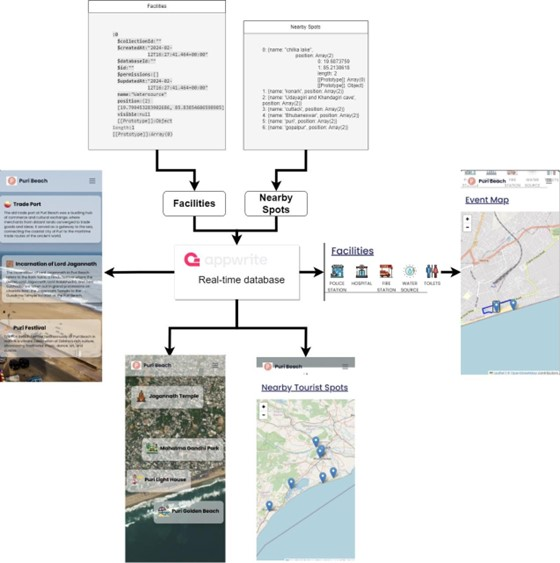
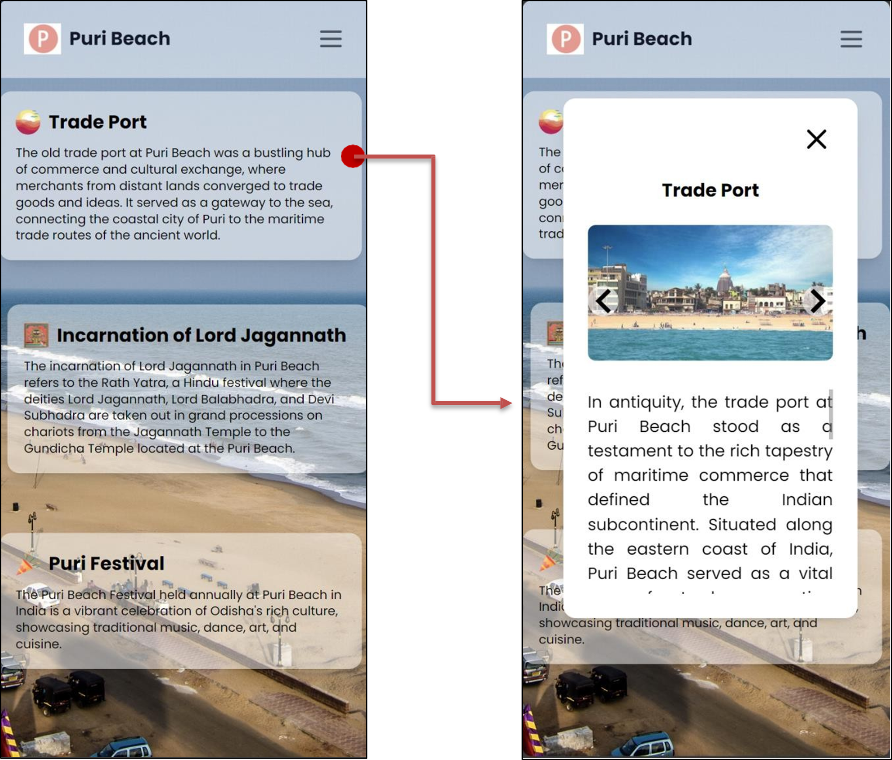
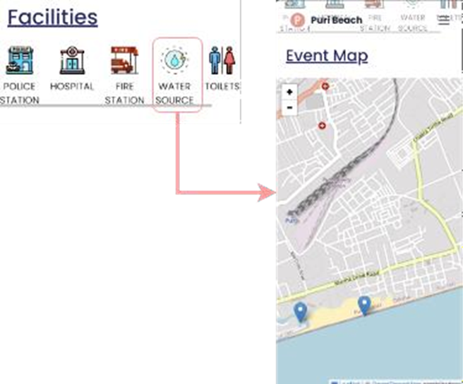
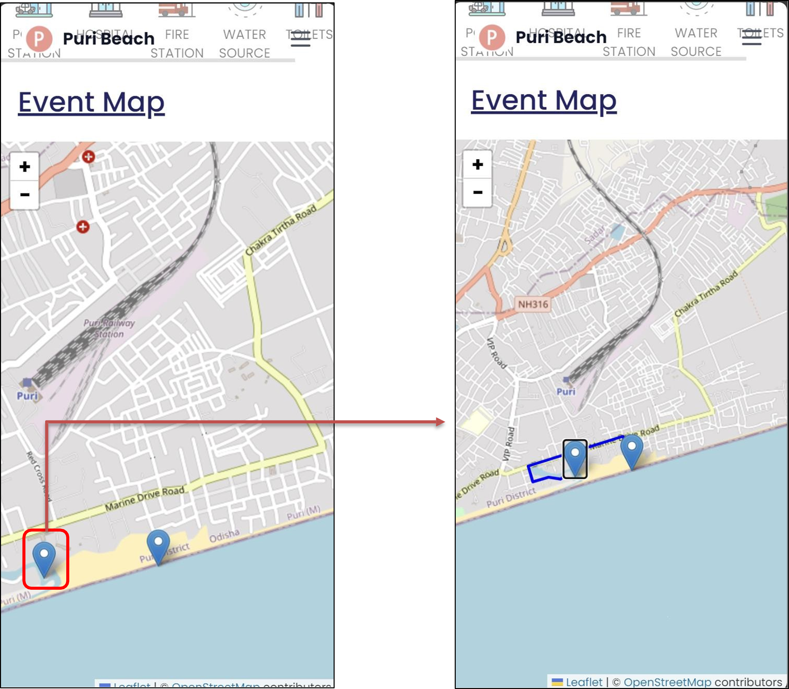

# 🎉 Crowd Management System for Tourist Spots & Festivals 🌍

Welcome to the **Festmap - Crowd Management System**, designed for bustling tourist spots and lively festivals! 🏖️🎉 This web app has interactive mapping and guidance to make every visit safe, seamless, and informative. (In this project [Puri Beach](https://odishatourism.gov.in/content/tourism/en/discover/attractions/beaches/puri-beach.html) was used as sample)

---

## 📋 Table of Contents

- [✨ Overview](#-overview)
- [🌟 Features](#-features)
- [🛠️ Technology Stack](#-technology-stack)
- [🚀 Installation](#-installation)
- [📖 Usage](#-usage)
- [📂 Project Structure](#-project-structure)
- [📸 Screenshots & Demos](#-screenshots--demos)
- [🤝 Contributions](#-contributions)
- [📜 License](#-license)

---

## ✨ Overview

In crowded event settings, festmap allows visitors to access real-time data and enjoy a guided experience with **interactive maps**, **facilities locators**, and **historical insights**. This project ensures seamless connectivity and navigation even in remote or crowded areas! 🌐💼

---

## 🌟 Features

- **🗺️ Real-Time Mapping**: Interactive maps display the exact locations of amenities (restrooms, medical aid) and tourist attractions, with clickable markers for additional info.
- **📍 Guided Navigation**: Visitors receive turn-by-turn directions, ensuring they find what they need.
- **📸 Nearby Attractions**: Discover nearby landmarks with visual pop-ups, creating a richer visitor experience.
- **📜 Cultural Highlights**: Immerse yourself in stories, pictures, and slideshows about the location’s history and culture.
- **💻 User-Friendly Design**: Sleek navigation bar, responsive interface, and streamlined categories for a smooth experience across devices.

---

## 🛠️ Technology Stack

### Frontend 🌐

- **React with TypeScript** ⚛️: Build fast, maintainable, and scalable interfaces.
- **Tailwind CSS** 🎨: A utility-first CSS framework for rapid and responsive design.

### Backend 🔧

- **Appwrite** 🛠️: Real-time data sync, database management, and secure storage.

### Services 🌍

- **OpenRouteService** 🚗: For accurate routing, accessibility analysis, and directions.

---

## 🚀 Installation

1. **Clone the repository** 📥:
   ```bash
   git clone https://github.com/Shanmathan/festmap.git
   ```
2. **Navigate to the project directory** 📂:
   ```bash
   cd your-repo
   ```
3. **Install dependencies** 📦:
   ```bash
   npm install
   ```
4. **Configure API keys** 🔑: Add your `Appwrite` and `OpenRouteService` keys in a `.env` file:

```plaintext
  VITE_APPWRITE_ENDPOINT=<Your Appwrite Endpoint>
  VITE_APPWRITE_PROJECT_ID=<Your Appwrite Project ID>
  VITE_APPWRITE_FACILITIES_DATABASE_ID=<Your Facilities Database ID>
  VITE_APPWRITE_FACILITIES_COLLECTION_ID=<Your Facilities Collection ID>
  VITE_APPWRITE_NEARBYSPOTS_DATABASE_ID=<Your NearbySpots Database ID>
  VITE_APPWRITE_NEARBYSPOTS_COLLECTION_ID=<Your NearbySpots Collection ID>
  VITE_OPENROUTESERVICE_API_KEY=<Your OpenRouteService API Key>
```

5. **Start the development server** 🏃:
   ```bash
   npm run dev
   ```

---

## 📖 Usage

1. **Launch the app** by navigating to `http://localhost` 🌐.
2. **Explore Attractions** 🌅: View and click on markers for details about points of interest.
3. **Find Facilities** 🏥: Quickly locate essentials like restrooms and water stations.
4. **Cultural Insights** 🏛️: Read about the area’s history, enriched with visuals and slideshows.

---

## 📂 Project Structure

```plaintext
├── src
│   ├── assets          # All the static assets used in the project
│   ├── components      # Reusable UI components
│   ├── config          # Main page components (History, Attractions, Facilities)
│   ├── constants       # All Constants and Varaibles for this project
│   ├── interfaces      # API interactions with Appwrite and OpenRouteService
│   └── App.tsx         # Main application file
└── README.md
```

---

## 📸 Screenshots & Demos

### Flowchart 📊



### Attractions Page 🎉

<div style="background-color: white; padding: 10px;">
  
</div>
<div style="background-color: white; padding: 10px;">
  
</div>

### Event Map 🏥

<div style="background-color: white; padding: 10px;">
  
</div>
<div style="background-color: white; padding: 10px;">
  
</div>

### Nearby Tourist Spots 🌆

<div style="background-color: white; padding: 10px;">
  
</div>

These GIFs show the app’s seamless user experience, from map navigation to nearby tourist spot discovery! 🌐✨

---

## 🤝 Contributions

Contributions are always welcome! 🎉 Simply fork this repo, make your changes, and open a pull request with a summary of your updates.

1. **Fork the repository** 🍴.
2. **Create a new branch** 🔄:
   ```bash
   git checkout -b feature/amazing-feature
   ```
3. **Make your changes** and **commit** ✅.
4. **Push to the branch** 🚀:
   ```bash
   git push origin feature/amazing-feature
   ```
5. **Open a Pull Request** 🔥.

---

## 📜 License

Distributed under the MIT License. See `LICENSE` for more information.
